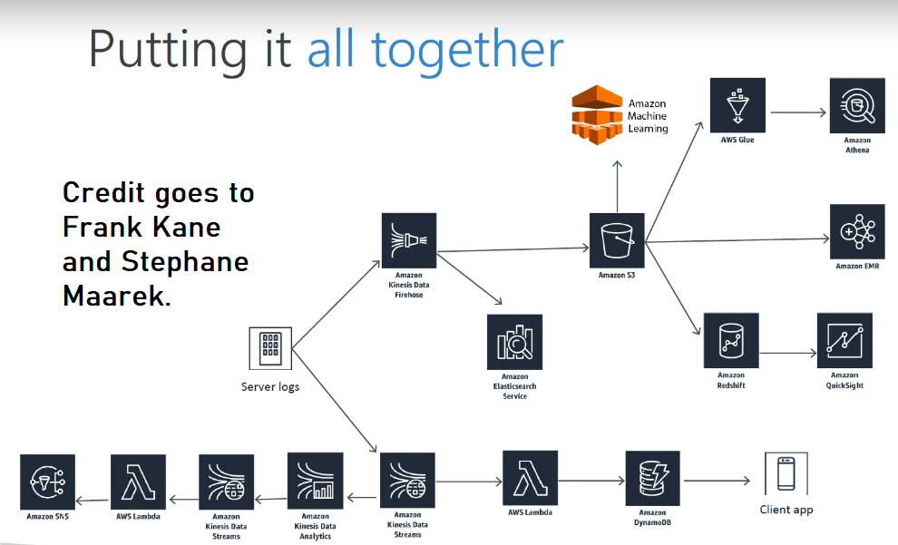

# CadabraOrders

My attempt to recreate the project exercises from Frank Kane's (Sundog Education) and Stephane Maarek's (DataCumulus) [AWS Certified Data Analytics Specialty course on Udemy](https://www.udemy.com/course/aws-big-data/), but with Terraform. 

I passed tha AWS Data Analytics Speciality certificate exam back in July 2020. I wrote an [article on Medium](https://medium.com/@yared94/how-i-passed-the-aws-data-analytics-specialty-certification-46a6c838a80) and in it I higlighted the course as one that helped me prepare for the exam. It took me at least 60%-70% of the way.

## Overview

(Picture from course referenced to above.)